# IMager bot
## О чем речь?
IMager - пакет, позволяющий собрать картинку из картинок, тематично скачанных с сайта [Fonwall](fonwall.com), или собственноручно загруженных.

IMager bot - телеграм бот, реализующий интерфейс пользователя для пакета IMager.

## Каков в действии
|   |   |
|---|---|
||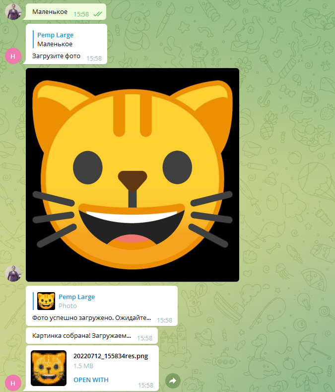|

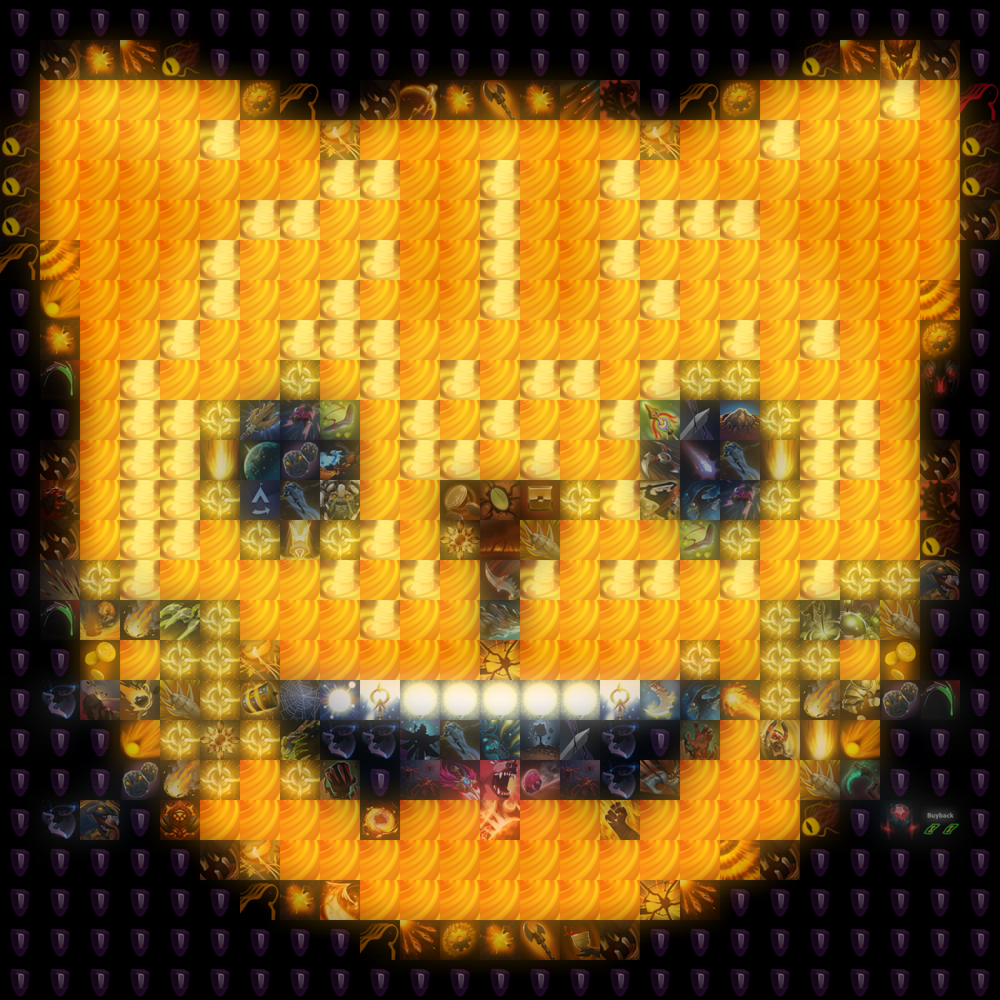

## Поэтапно
### Общее
При старте бота `/start` он здоровается и предлагает на выбор общие команда:
1. /Начать
2. /Поддержать
3. /Помощь

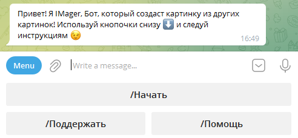

##### 1. Начать
Команда `/Начать` инициализирует FSM.

##### 2. Поддержать
Команда `/Поддержать` выводит информацию для поддержки разработчка (Кнопка для красоты)

##### 3. Помощь
Команда `/Помощь` выводит сообщение `/start` (со скриншота выше)

##### (+) 4. В начало
В дальнейших состояниях появится кнопка `В начало`, переводящая в общее меню. 

---
### /Начать - Выбрать тему
Входим в FSM

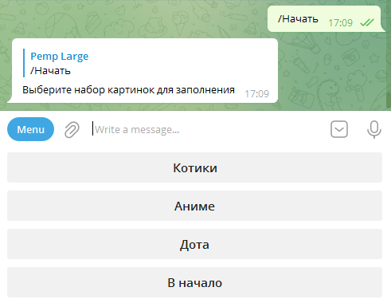

На выбор предоставляется набор тем для заполнения. Данный набор регулируется разработчкиом.

---
### Выбрать степень шума
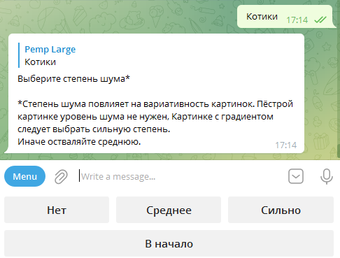

После выбранной темы предлагается выбрать [степень шума](#1-степень-шума)

---
### Выбрать размер изображения


После выбранной степени шума предлагается выбрать [размер изображения](#2-размер-изображения)

### Загрузить картинку


После выбранного размера картинки предлагается загрузить картинку
#### Ожидание и результат
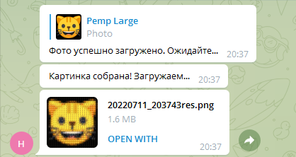

Результат присылается файлом в формате *.png

## Технологии
* Python 3.9+
* Pillow
* Poetry
* Sqlite3
* git
* linux
* VSCode/Sublime Text 3

## Дополнительныая информация об исполнении
### Наложение оригинала
На каждую собранную картинку сверху накладывается оригинал.<br>
Это позволяет сгладить "неровности" вставленных картинок и подогнать к оригиналу.

Оригинал конвертируется в RGBA с установленным альфа-каналом 120/256, что дает такой результат:

Данные:
|Тема|Степень шума|Размер|Картинка|
|---|:---:|---|---|
|Котики|Средняя|Большое|Случайная|

| Без наложения | С наложением |
|:---:|:---:|
|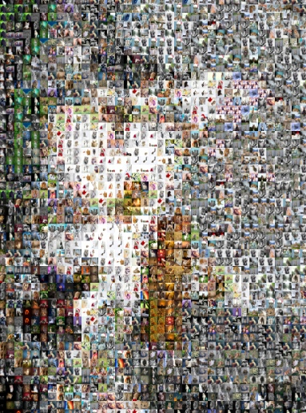|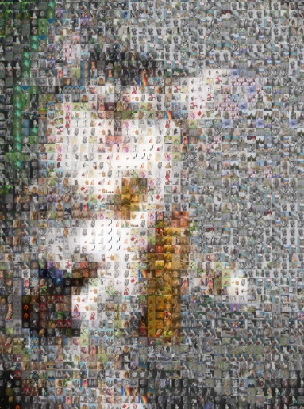|

### Нагрузка на оперативную память
Для ускоренной работы приложения и сборки в оперативной памяти хранится информация о:
* rgb + имя каждой картинки из используемых тем.
* Объект каждой прочитанной в картинки изиспользуемых тем.
Даже с учетом обычного [набора данных](#наборы-картинок) программа занимает ±200Мб ОЗУ.

## Установка
1. Клонировать репозиторий

```git clone git@github.com:LittlePemp/IMager.git```

2. Установить зависимости
Для работы с менеджером пакетов Poetry можно воспользоваться [шпаргалками](https://habr.com/ru/post/593529/)

3. Настраиваем под запуск бота
Приложение работает с помощью управляющего скрипта и [командами](#3-команды-приложения) к нему.

## Приложение
### [0] Тестовые данные
#### Наборы картинок:
*Высота картинок в среднем 750px
1. Котики (2 282 картинки)
2. Аниме (733 картинки)
3. Дота (1 209 картинок)
#### Степени шума:
1. Нет (0)
2. Среднее (от 0 до 12 )
3. Сильно (от 12 др 30)
#### Размеры собранного изображения:
1. 25 картинок
2. 50 картинок
3. 100 картинок
### [1] Степень шума.
Степень шума - важный параметр, используемы для сборки картинки.

О важности наличия шума в аудиотреках, изображениях и тд. можно много говорить: советую ознакомиться с данной статьей [эстетика шума в аналоговой музыке](https://habr.com/ru/post/403927/). В ней поднимаются достаточно интересные вопросы для размышления.

Что на практике?

Рассмотрим важность шума на практике.<br>
Каждое поле RGB хранит по 256 значений (8 бит) для обычных картинок. Чтобы покрыть каждое возможное значение цвета потребуется 256^3 (2^24) картинок.<br>
Во-первых, практически невозможно найти, например, (0, 0, 255) адекватную картинку, если не просто синий квадрат, от чего не смысла.<br>
Во-вторых, иметь и обрабатывать такое количество изображений - безумство.

Поэтому на картинку, соответствующей определенному цвету, претендуют остальные цвета, находящиейсе относительно вблизь.

Из этого следуеют некоторые решения<br>
1. Если определенному набору $RGB(r, g, b)$ соответствует несколько близжайших по среднему цвету картинок {$A_1(r_1, g_1, b_1)$, $A_2(r_2, g_2, b_2)$, $A_3(r_3, g_3, b_3)$ ...} с расстояниями {$ρ_{1}, ρ_{2}, ρ_{3} ...$}, где<br>$ρ_{1} <= ρ_{2} <= ρ_{3} <= ...$ соответственно, а <br>$ρ_{i} = \sqrt{(r_{i} - r)^2 + (g_{i} - g)^2 + (b_i - b)^2}$. Чтобы найти новую, но достаточно близкую картинку, посчитаем новые значения $ρ_{i}^{*} = |ρ_{i} - randint(rand1, rand2)|$, где $0 <=rand1, rand2$ - значение разброса.
2. Либо напрямую изменить каждое поле и также икать близжайшее:<br>$RGB^*(r ± randint(rand3), g ± randint(rand3), b ± randint(rand3))$, где $rand3 \simeq \sqrt[3]{(rand2)}$.

Из этого следует следующий эффект:

**1. Отсутствие шума. Плохой расклад.**

Данные:
|Тема|Степень шума|Размер|Картинка|
|---|:---:|---|---|
|Дота|Нет|Большое|Градиент|

<details><summary>Оригинал</summary><br>
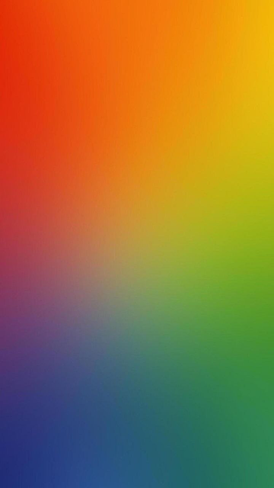</details>

<details><summary>Результат</summary><br>
</details>

<details><summary>Увеличение</summary><br>
</details>

Заметно, что при таком раскраде происходит по теории выше. Одна картинка по охватывает некоторый диапазон цветов.

---

**2. Сильный шум. Хорошый расклад**

Данные:
|Тема|Степень шума|Размер|Картинка|
|---|:---:|---|---|
|Дота|Сильно|Большое|Градиент|

<details><summary>Оригинал</summary><br>
</details>

<details><summary>Результат</summary><br>
</details>

<details><summary>Увеличение</summary><br>
</details>

В данном случае это выглядит намного органичнее.

**3. Отсутствие шума. Хороший расклад.**

Стоит отметить, что при уже пестрой картинке наличие шума будет излишним.

Данные:
|Тема|Степень шума|Размер|Картинка|
|---|:---:|---|---|
|Дота|Сильно|Большое|Пёстрая|

<details><summary>Оригинал</summary><br>
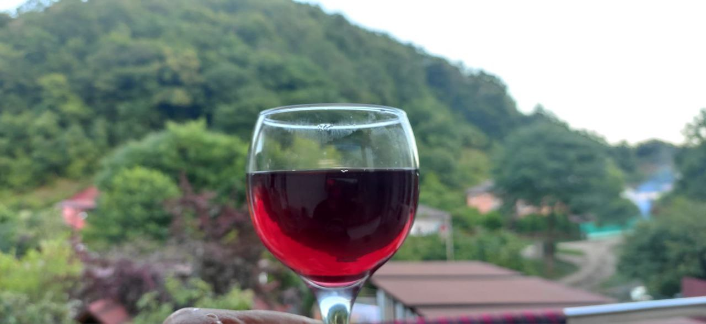</details>

<details><summary>Результат</summary><br>
</details>

<details><summary>Увеличение</summary><br>
</details>

Как видно, данная картинка отлично смотрится при отсутствии шума. С сильным шумом тут будет просто хаос.

### [2] Размер изображения.
"Размеры изобпажения" (далее просто размер изображения) устанавливаются разработчиком и в совокупе с размером вставляемой картинкой ограничиваются библиотекой python `Pillow`.

Размер изображения представляет собой количество вставленных картинок по наибольшей стороне. Т.е. из картинки с разрешением 250х500px с настройками: {Размер изображения: 50, ширина вставляемой картинки (которая тоже устанавливается разработчиком): 50px} создастся новая картинка размером 25х50 картинок с разрешением 1250ъ2500px!!

Следуя из вышеперечисленного понятно, что в собранной картинке из картинке с мелкими элементами они пропадут.<br>
Тогда следует почти всегда исользовать большое разрешение.

Смысл маленького размера имеется в данном случае, показанном на примере:

Данные:
|Тема|Степень шума|Размер|Картинка|
|---|:---:|---|---|
|Дота|Среднее|Маленькое|Маленькая, с большими элементами|

<details><summary>Оригинал</summary><br>
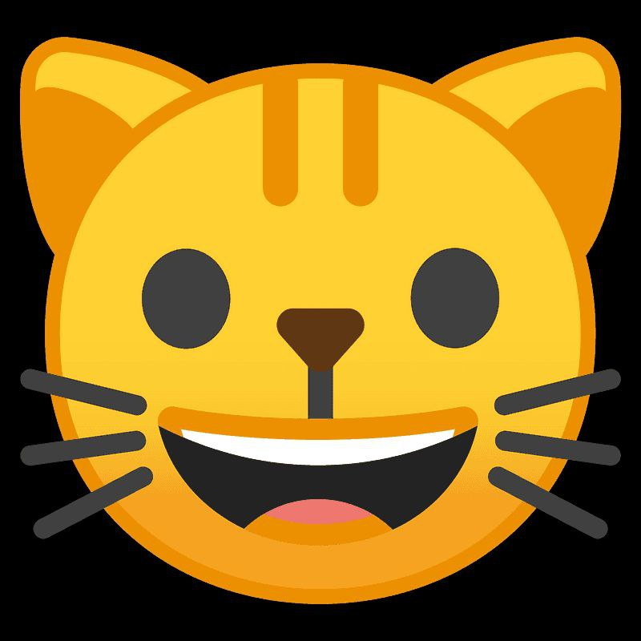</details>

<details><summary>Результат</summary><br>
</details>

### [3] Команды приложения.
Получить список команд можно запустив скрипт

```python manage.py```

Вывод:<br>
```>> ...Commands: ['download_topic', 'show_db_distribution', 'start', 'test_engine', 'update_db', 'update_db_single']```

#### **Команда @download_topic**
Команда позволяет скачать картинки с сайта (fonwall.com)[Fonwall]

```python manage.py download_topic```

a. Далее вводим набор картинок, например: "Коты"
b. Предлагается выбрать к какому набору докачать новые картинки или создать новую.
с. После выбора начнется парсинг. Для останоовки парсинга нажать комбинацию (Ctrl + c), либо дождаться окончания парсинга.
d. После парсинга начнется скачивание новых изображений.

#### **Команда @update_dp**
Команда позволяет обновить полностью бд на основе директорий.

```python manage.py update_db```

#### **Команда @update_dp_single**
Команда позволяет обновить или добавить одну определенную таблицу в бд на основе директории с картинками.

```python manage.py update_db_single```

#### **Команда @show_db_distribution**
Команда позволяет посмотреть распределение картинок на RGB палитре.

```python manage.py show_db_distribution```

Например:
| Коты | Дота |
|:---:|:---:|
|||

#### **Команда @test_engine**
Программа собирает картинку без учета телеграм бота. На вывод получите абсольтный путь к итоговой картинке.

```python manage.py test_engine```

a. В начадле выбираем набор картинок для заполнения
b. Далее вводим абсолютный путь до картинки

#### **Команда @start**
Команда запускает функционирующего бота.

```python manage.py start```

### [4] Дерево приложения
```
IMager
├───content
│   ├───results
│   │   ├───<Собранные картинки>
│   ├───TEMP
│   │   ├───<Промежуточные файлы для сборки>
│   ├───topics
│   │   ├───<Темы изображений>
│   └───users_images
│       |───<Темы изображений>
├───IMager_bot
│   ├───commands
│   │   └───<Комманды прилжения>
│   ├───IMager
│   │   ├───exceptions
|   |   |   └───<Некоторые кастомные исключения>
|   |   └──<Скрипты приложения>
│   ├───settings
│   │   └───<Конфиги и еще кастомные исключения>
│   ├───tg_bot
│   │   ├───handlers
│   │   │   └───<Хендлеры бота>
│   │   ├───keyboards
│   │   │   └───<Клавиатуры бота>
│   │   └───<Основные файлы бота>
│   └───manage.py
└───readme_content
    └───<Картинки для README.md>
```